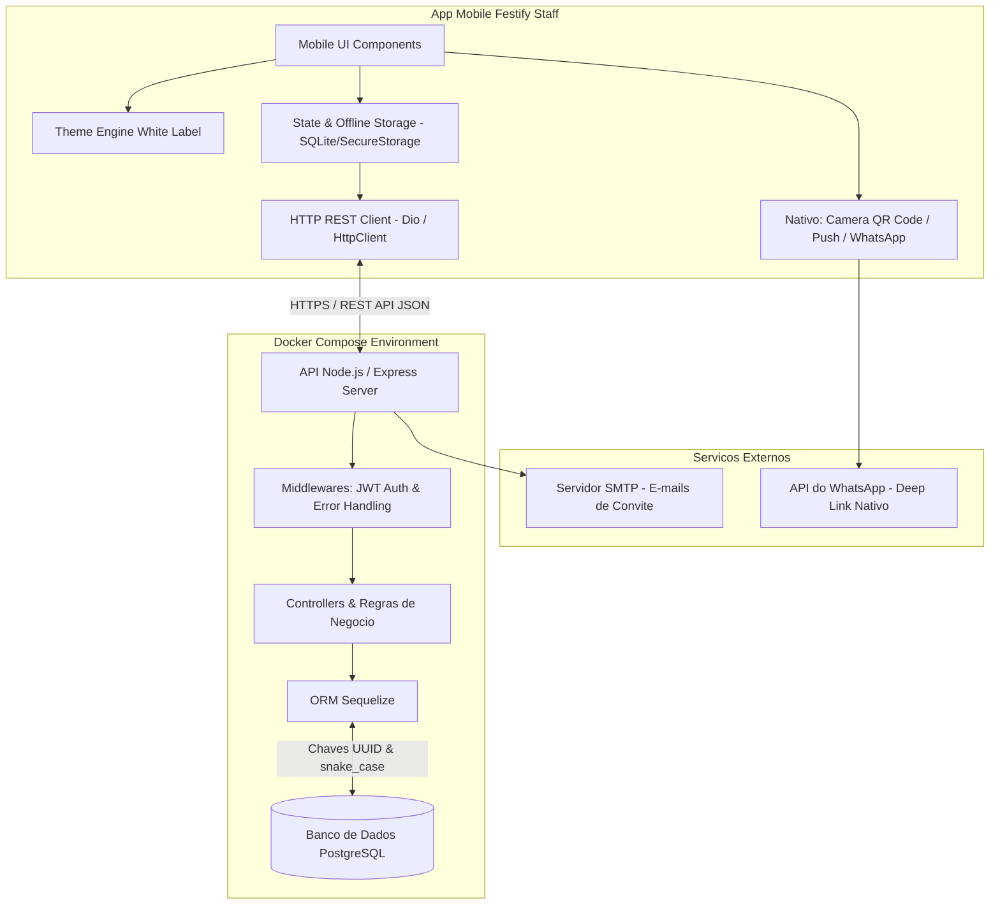
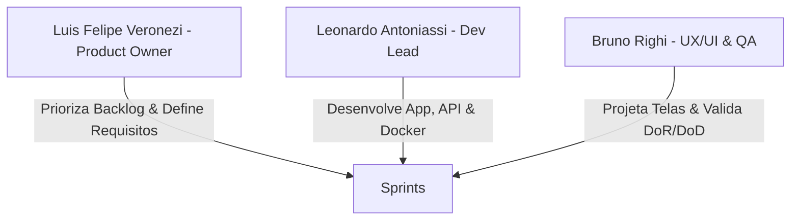
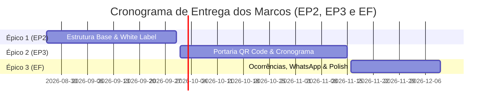

# PLANO DE PROJETO ÁGIL DE SOFTWARE
## Aplicativo Móvel: Festify Staff — Plataforma SaaS White Label de Gestão de Eventos e Buffets

---

## SEÇÃO PRÉ-TEXTUAL: HISTÓRICO DE REVISÃO

| Data | Versão | Descrição das Alterações | Autor(es) |
| :---: | :---: | :--- | :--- |
| 26/08/2026 | 1.0 | Elaboração inicial do documento do Plano de Projeto Ágil de Software para o App Mobile (Festify Staff), incluindo Canvas de Negócio, Arquitetura Híbrida, Backlog de Histórias de Usuário, Cronograma de 6 Sprints, DoR/DoD e Matriz de Riscos. | Luis Felipe Veronezi (PO), Leonardo Antoniassi (Dev), Bruno Righi (UX/QA) |

---

# 1. INTRODUÇÃO

### 1.1 Apresentação do Documento e Visão Geral
Este documento formaliza a iniciação do projeto ágil de software para o desenvolvimento da extensão móvel (**Festify Staff**), referente ao Projeto Integrador do 5º semestre do curso de Desenvolvimento de Software Multiplataforma. O projeto consiste na evolução e pivotagem da plataforma web de gestão de eventos para um modelo **SaaS B2B Multilocatário (White Label)** denominado **Festify**.

O foco central deste semestre é o desenvolvimento do aplicativo móvel híbrido focado na **equipe operacional em campo** (recepcionistas, garçons, recreadores, gerentes de salão e equipe de apoio), permitindo a execução das atividades do dia do evento com alta mobilidade, precisão e personalização visual dinâmica para cada buffet contratante.

### 1.2 Contexto de Negócio: Business Model Canvas
A transição da plataforma de um sistema sob medida para um ecossistema **SaaS B2B White Label** permite que salões de festas, buffets infantis e espaços de eventos assinem a plataforma e ofereçam uma experiência totalmente personalizada com sua própria identidade visual aos seus funcionários e clientes.

#### Canvas do Modelo de Negócio (Festify SaaS B2B)

| Bloco do Canvas | Descrição Detalhada |
| :--- | :--- |
| **Parcerias-Chave** | Provedores de nuvem (AWS/GCP), Serviços de E-mail Transactional (SMTP / SendGrid), Provedor de Notificações Push (Firebase Cloud Messaging - FCM), Lojas de Apps (Google Play Store e Apple App Store). |
| **Atividades-Chave** | Desenvolvimento contínuo da API backend REST, manutenção do aplicativo móvel multiplataforma, suporte a injeção dinâmica de temas White Label, gerenciamento de infraestrutura em containers Docker. |
| **Recursos-Chave** | API Central Node.js/Express, Banco de dados relacional PostgreSQL, Código-fonte mobile em .NET MAUI / Flutter, equipe técnica de desenvolvimento e infraestrutura Docker. |
| **Proposta de Valor** | Plataforma de gestão B2B White Label para buffets que injeta automaticamente a identidade visual do cliente (logo, nome fantasia e cores), simplificando a operação de campo, recepção por QR Code e controle de escalas. |
| **Relacionamento com Clientes** | Atendimento automatizado, onboarding de contratantes, suporte via canal direto de atendimento e autosserviço no painel web administrativo. |
| **Canais** | Plataforma Web administrativa, Aplicativo móvel (iOS/Android), integração direta com WhatsApp para notificações e campanhas de marketing digital B2B. |
| **Segmento de Clientes** | Buffets infantis, casas de festas e eventos corporativos, espaços de casamentos/formatura e empresas de cerimonial que necessitam de gestão operacional em campo. |
| **Estrutura de Custos** | Custos de hospedagem e servidores de banco de dados, licenças de ferramentas de desenvolvimento, custos de publicação nas lojas de aplicativos (Apple/Google) e esforço de engenharia. |
| **Fontes de Receita** | Assinatura mensal/anual do SaaS por plano (por volume de festas ou número de unidades/salões), taxa de onboarding e personalização de módulo White Label. |

### 1.3 Contexto do Aplicativo Móvel no Ecossistema
O aplicativo móvel **Festify Staff** não é um aplicativo isolado; ele é uma peça fundamental do ecossistema integrado Festify:

```
+-----------------------------------------------------------------------+
|                       ECOSSISTEMA FESTIFY                             |
|                                                                       |
|  +------------------------+             +--------------------------+  |
|  |       Painel Web       |             | App Mobile Festify Staff |  |
|  |  (Gestão / Dashboard)  |             |  (Operação de Campo)     |  |
|  +-----------+------------+             +------------+-------------+  |
|              |                                       |                |
|              +-------------------+-------------------+                |
|                                  |                                    |
|                       +----------v----------+                         |
|                       | API Central Node.js |                         |
|                       |  (Express / ORM)    |                         |
|                       +----------+----------+                         |
|                                  |                                    |
|                       +----------v----------+                         |
|                       |   PostgreSQL DB     |                         |
|                       |  (Docker Compose)   |                         |
|                       +---------------------+                         |
+-----------------------------------------------------------------------+
```

* **Plataforma Web Administrativa:** Utilizada pelos donos e gerentes do buffet para cadastrar eventos, criar orçamentos, configurar a identidade visual (logo, cores) e gerenciar contratos.
* **API Central REST (Node.js/Express + ORM Sequelize):** Concentra as regras de negócio, autenticação JWT, controle de choques de agenda e persistência.
* **App Mobile (Festify Staff):** Consome a API central para estender as funcionalidades para o dia do evento no salão de festas, provendo portaria com QR Code, escalas de trabalho, cronograma vivo e chamadas via WhatsApp.

### 1.4 Motivação para o Desenvolvimento do App
A operação no dia de uma festa de buffet é dinâmica e com ritmo acelerado. O uso de computadores desktop ou notebooks na portaria e no salão é inviável e gera gargalos, como filas de convidados e desencontro de informações entre a cozinha, os garçons e a recepção. A criação do app móvel se justifica por:
1. **Mobilidade Total:** Permitir que recepcionistas e garçons realizem suas tarefas diretamente do smartphone no chão do salão.
2. **Redução de Erros de Portaria:** Substituição de listas de papel por leitores nativos de QR Code no celular.
3. **Agilidade na Comunicação:** Acionamento de equipe e contratantes via WhatsApp em apenas um clique.
4. **Diferencial Comercial White Label:** Permitir que o buffet apresente o aplicativo com sua própria marca para os funcionários, aumentando a percepção de valor do SaaS.

### 1.5 Identificação do Grupo de Trabalho
* **Nome da Equipe:** L2Tech
* **Membros do Time e Papéis Scrum:**
  * **Luis Felipe Veronezi** — *Product Owner (PO)*: Responsável pela visão do produto, priorização do Backlog e alinhamento dos requisitos de negócio.
  * **Leonardo Antoniassi** — *Desenvolvedor Fullstack (Dev Lead)*: Responsável pela arquitetura técnica, desenvolvimento do aplicativo móvel, integração com a API Node.js e Docker.
  * **Bruno Righi** — *UX/UI Designer & QA Engineer*: Responsável pelo design de interfaces (UI), experiência do usuário (UX), injeção de temas White Label e garantia de qualidade (QA).

### 1.6 Repositórios Git do Projeto
* **Repositório do Aplicativo Móvel (Festify Staff):** [https://github.com/leoantoniassi/festify-staff](https://github.com/leoantoniassi/festify-staff)
* **Repositório da Plataforma Web / API Central (Festify Core):** [https://github.com/leoantoniassi/festify](https://github.com/leoantoniassi/festify)

---

# 2. APLICATIVO PARA DISPOSITIVO MÓVEL

### 2.1 Visão do Produto
> *"Para buffets e salões de festas contratantes do ecossistema Festify que necessitam de agilidade e controle na execução operacional de eventos, o **Festify Staff** é um aplicativo móvel híbrido White Label que permite a validação de convidados por QR Code, consulta de escalas, acompanhamento do cronograma da festa em tempo real e registro de contagem de público. Diferente de sistemas tradicionais baseados em papel ou tabelas manuais, nosso aplicativo injeta dinamicamente a marca e as cores do buffet, funciona com resiliência offline e integra-se perfeitamente à API central de gestão."*

Quando totalmente pronto e integrado, espera-se que o app seja a ferramenta diária de trabalho da equipe de campo do buffet, garantindo portarias sem filas, comunicação eficiente e total auditabilidade dos eventos.

### 2.2 Objetivos do Desenvolvimento do App
* **Agilizar o Check-in na Recepção:** Reduzir o tempo médio de validação de convidados na entrada do evento para menos de 3 segundos por pessoa através da leitura de QR Code.
* **Automatizar o Controle de Escalas de Funcionários:** Permitir que a equipe operacional confirme presenças e consulte suas funções do dia diretamente no aplicativo.
* **Prover Cronograma Vivo e Notificações:** Garantir que todos os colaboradores saibam exatamente os horários de servir entradas, refeições, parabéns e encerramento do evento.
* **Suportar Customização Dinâmica White Label:** Aplicar a paleta de cores (`primary_color`, `secondary_color`) e o logotipo do buffet contratante imediatamente no momento do login.
* **Fornecer Auditoria de Lotação:** Registrar a quantidade exata de adultos e crianças presentes no salão via catraca digital.

### 2.3 Arquitetura Básica da Solução

#### 2.3.1 Descrição Textual dos Componentes
O aplicativo móvel adota uma arquitetura em camadas orientada a serviços REST:
1. **Camada de Apresentação (Mobile UI Layer):** Desenvolvida em tecnologia multiplataforma (.NET MAUI / Flutter), organizada em componentes visuais redefiníveis que consomem um gerenciador de temas dinâmico para renderizar as cores e logos do buffet contratante.
2. **Camada de Gerenciamento de Estado e Cache Local:** Utiliza `SecureStorage` / `SQLite` para armazenar o token JWT de autenticação, o perfil da marca e a fila de requisições offline (resiliência de rede na portaria).
3. **Camada de Comunicação de Rede (HTTP Client):** Cliente HTTP com interceptadores para envio do Token JWT no cabeçalho `Authorization: Bearer <token>` e tratamento automatizado de reconexão.
4. **Backend API REST Central (Node.js & Express):** Servidor hospedado em container Docker contendo as rotas de autenticação, escalas, eventos e convidados.
5. **Camada de Persistência (ORM Sequelize & PostgreSQL):** Banco de dados relacional orquestrado via Docker Compose, com chaves primárias padronizadas em `DataTypes.UUID` e nomenclatura em `snake_case`.

#### 2.3.2 Diagrama da Arquitetura de Componentes



### 2.4 Metas e Restrições da Arquitetura

| Categoria | Especificação Técnica | Justificativa / Motivação |
| :--- | :--- | :--- |
| **Plataforma Mobile** | Multiplataforma (.NET MAUI / Flutter) | Permite compilar código único para Android e iOS, reduzindo o tempo de desenvolvimento em 50% mantendo excelente performance nativa para acesso à câmera. |
| **Consumo de API** | RESTful com formato JSON | Padronização universal de comunicação e facilidade de integração com a API existente Node.js/Express. |
| **Persistência Backend** | PostgreSQL + Sequelize ORM | Banco de dados relacional robusto com integridade referencial. Uso obrigatório de `DataTypes.UUID` para evitar colisões e chaves previsíveis. |
| **Nomenclatura DB** | Campos estritamente em `snake_case` | Conformidade com as boas práticas de banco relacional PostgreSQL e padronização do projeto. |
| **Infraestrutura** | Containers orquestrados com Docker Compose | Garante reprodutibilidade total do ambiente de desenvolvimento e produção entre os estudantes da equipe. |
| **Customização White Label** | Injeção dinâmica de identidade visual | Cada buffet contratante possui sua logo (`logo_url`) e paleta de cores (`primary_color`, `secondary_color`) injetadas no app via endpoint de configuração. |
| **Resiliência Offline** | Cache local de portaria em SQLite/SecureStorage | Salões de festa frequentemente possuem sinal fraco de internet; a validação de QR Code e contagem deve continuar funcionando localmente e sincronizar ao reconectar. |

---

# 3. PROJETO ÁGIL DE SOFTWARE

### 3.1 Escopo do Projeto (Delimitação de Entregas do Semestre)
Neste projeto do 5º semestre, será desenvolvido o aplicativo móvel **Festify Staff** contendo os 5 pilares operacionais selecionados:
1. **Recepção e Portaria Inteligente:** Validação de convidados via QR Code com câmera nativa e adição de acompanhantes extras.
2. **Escala de Trabalho e Ponto Digital:** Confirmação de presença da equipe (Aceitar/Recusar) e visualização do setor/função do dia.
3. **Contador de Público e Catraca Digital:** Contagem rápida de adultos e crianças com barra visual de lotação limite do salão.
4. **Comunicação, Ocorrências e WhatsApp:** Disparo de mensagens no WhatsApp via 1 clique e registro de avarias/quebras com captura de fotos da câmera.
5. **White Label Dinâmico e Resiliência Offline:** Aplicação da identidade visual do buffet contratante e cache local em caso de queda de conexão.

*Fora do escopo mobile deste semestre:* Módulo completo de assinatura de contratos e criação financeira de orçamentos (mantidos estritamente no Painel Web Administrativo).

### 3.2 Papéis e Responsabilidades no Time Scrum



* **Product Owner (PO) — Luis Felipe Veronezi:**
  * Refinamento do Backlog do Produto e escrita de Histórias de Usuário.
  * Validação das entregas de acordo com os critérios de aceite.
  * Gestão do cronograma e contato com o docente responsável pelo PI.
* **Dev Lead / Fullstack Developer — Leonardo Antoniassi:**
  * Implementação do aplicativo móvel híbrido e suas integrações.
  * Manutenção das rotas da API Node.js/Express e modelos Sequelize com UUID.
  * Configuração e orquestração dos serviços via Docker Compose.
* **UX/UI Designer & QA Engineer — Bruno Righi:**
  * Criação dos protótipos de alta fidelidade e design system White Label.
  * Execução dos testes funcionais de interface e validação da experiência do usuário.
  * Garantia de conformidade com as normas de acessibilidade e usabilidade móvel.

### 3.3 Backlog do Produto (Histórias de Usuário)

| ID | História de Usuário (US) | Critérios de Aceite | Prioridade |
| :---: | :--- | :--- | :---: |
| **US01** | **Como** colaborador do buffet, **quero** fazer login informando o código da empresa, **para que** o aplicativo aplique automaticamente o logotipo e as cores do salão onde trabalho. | • Deve consumir o endpoint `/api/v1/tenant/config`.<br>• Deve atualizar dinamicamente a paleta de cores primária e secundária na UI.<br>• Deve exibir a logo oficial do salão na barra superior. | **Alta** (Must Have) |
| **US02** | **Como** membro da equipe operacional, **quero** visualizar minhas escalas de trabalho e confirmar presença, **para que** o gerente saiba que estarei presente no evento. | • Lista de festas futuras filtradas pelo ID do usuário.<br>• Botões claros de "Aceitar" e "Recusar" escala.<br>• Exibição da função (ex: Garçom, Recreador) e setor. | **Alta** (Must Have) |
| **US03** | **Como** recepcionista do evento, **quero** escanear o QR Code do convite do convidado com a câmera do celular, **para que** a entrada seja validada rapidamente. | • Leitura nativa em menos de 2 segundos.<br>• Feedback visual verde para válido e vermelho para convidado já liberado.<br>• Exibição do nome e número de acompanhantes permitidos. | **Alta** (Must Have) |
| **US04** | **Como** porteiro do salão, **quero** utilizar uma catraca digital com botões de incremento/decremento, **para que** eu controle a contagem de adultos e crianças presentes. | • Botões táteis grandes `+1` / `-1` para Adultos e Crianças.<br>• Barra de progresso indicando % da capacidade total atingida.<br>• Sincronização da contagem com o servidor central. | **Média** (Should Have) |
| **US05** | **Como** colaborador do evento, **quero** clicar em um ícone de WhatsApp ao lado do contato do cliente ou gerente, **para que** eu possa abrir uma conversa diretamente no aplicativo nativo. | • Utilização de Deep Link (`whatsapp://send?phone=...`).<br>• Pré-preenchimento opcional do nome do evento.<br>• Funcionar em dispositivos Android e iOS. | **Média** (Should Have) |
| **US06** | **Como** gerente do evento, **quero** tirar fotos de itens danificados ou avarias durante a festa pelo app, **para que** o incidente seja registrado com imagem no relatório final. | • Acesso à câmera nativa do dispositivo.<br>• Upload da imagem em formato `multipart/form-data`.<br>• Vinculação automática da foto ao ID do evento no banco. | **Média** (Should Have) |
| **US07** | **Como** recepcionista, **quero** que as validações de entrada continuem funcionando mesmo com queda de internet, **para que** a portaria não fique paralizada. | • Armazenamento local temporário no SQLite/SecureStorage.<br>• Fila de sincronização enviada automaticamente ao restabelecer a rede.<br>• Indicador visual de "Modo Offline" na tela. | **Baixa** (Nice to Have) |

### 3.4 Divisão do Trabalho em Grandes Fases (Marcos e Épicos)



* **Marco 1: EP2 (Entrega Parcial 2) — Data de Entrega: 30/09/2026**
  * *Épico:* Arquitetura Base, Injeção White Label e Módulo de Escalas da Equipe.
  * *Descrição:* Entrega da estrutura do app móvel conectada à API REST Node.js/Express, autenticação JWT, injeção dinâmica de temas e gestão de escalas de trabalho.
* **Marco 2: EP3 (Entrega Parcial 3) — Data de Entrega: 15/11/2026**
  * *Épico:* Portaria Inteligente (QR Code), Catraca Digital e Cronograma Vivo.
  * *Descrição:* Leitura de convites por câmera nativa, contagem de público em tempo real, integração com banco de dados PostgreSQL e cronograma de etapas da festa.
* **Marco 3: EF (Entrega Final) — Data de Entrega: 10/12/2026**
  * *Épico:* Integração WhatsApp, Registro de Ocorrências com Foto, Resiliência Offline e Homologação.
  * *Descrição:* Finalização dos recursos avançados, registros de avarias com envio de fotos, resiliência offline em SQLite, testes automatizados e apresentação final.

### 3.5 Planejamento de Sprints Quinzenais

| Mês / Épico | Sprint | Foco / Objetivo da Sprint | Entregáveis e Histórias (US) |
| :---: | :---: | :--- | :--- |
| **Setembro / EP2** | **Sprint 1** | Setup do Projeto Mobile, Docker & Autenticação | • Inicialização do repositório mobile.<br>• Estruturação de rotas de Auth JWT na API Express.<br>• Tela de Login e consumo do endpoint de tenant. (**US01**) |
| **Setembro / EP2** | **Sprint 2** | Motor White Label & Módulo de Escalas | • Implementação do `ThemeContext` dinâmico.<br>• Tela de listagem e aceite de escalas de trabalho. (**US02**)<br>• Validação da API Sequelize com chaves UUID. |
| **Outubro / EP3** | **Sprint 3** | Leitor de QR Code & Integração com Câmera | • Configuração do leitor de câmera nativo.<br>• Endpoint de validação de convites na API.<br>• Tela de feedback de entrada na portaria. (**US03**) |
| **Outubro / EP3** | **Sprint 4** | Catraca Digital & Cronograma do Evento | • Interface de contagem tátil (+1/-1) para adultos e crianças. (**US04**)<br>• Barra visual de progresso de lotação do salão.<br>• Componente de Timeline da festa em tempo real. |
| **Novembro / EF** | **Sprint 5** | Chamadas WhatsApp & Upload de Ocorrências | • Botão de integração com WhatsApp via Deep Link. (**US05**)<br>• Tela de registro de incidentes e envio de foto via `multipart`. (**US06**) |
| **Dezembro / EF** | **Sprint 6** | Resiliência Offline, Polish e Homologação | • Cache local de validações com SQLite/SecureStorage. (**US07**)<br>• Testes funcionais e correção de bugs.<br>• Geração do build final e documentação de entrega. |

### 3.6 Definição de Preparada (Definition of Ready - DoR)
Uma História de Usuário (US) é considerada **Preparada (Ready)** para entrar na Sprint se atender aos seguintes critérios:
1. **Descrição Clara:** A história segue o formato estrito: *Como [perfil], quero [ação], para que [benefício]*.
2. **Critérios de Aceite Definidos:** Possui critérios de aceitação objetivos e testáveis.
3. **Protótipo de Interface (UI):** O protótipo de tela no Figma foi desenhado e aprovado pelo UX Designer (Bruno Righi).
4. **Dependência Técnica Resolvida:** As rotas necessárias na API central Node.js/Express e tabelas no PostgreSQL já estão documentadas e disponíveis.
5. **Estimativa Realizada:** A história foi pontuada e cabe dentro de uma única Sprint quinzenal.

### 3.7 Definição de Pronta (Definition of Done - DoD)
Uma História de Usuário (US) é considerada **Pronta (Done)** e apta para entrega se atender aos seguintes critérios:
1. **Código Implementado e Revisado:** O código-fonte foi desenvolvido e revisado via *Pull Request (PR)* no GitHub.
2. **Aderência à Arquitetura:** O código segue os padrões do projeto (uso de UUIDs, `snake_case`, injeção dinâmica de temas).
3. **Testes Realizados:** A funcionalidade foi testada com sucesso em dispositivos Android e iOS (ou emulador/simulador).
4. **Sem Bugs Críticos:** Não existem erros de execução (*crashes*) ou bloqueios conhecidos na funcionalidade.
5. **Aprovação do PO:** O Product Owner (Luis Felipe Veronezi) validou e homologou a funcionalidade de acordo com a visão do produto.

### 3.8 Matriz de Gestão de Riscos

| Risco Identificado | Probabilidade | Impacto | Estratégia de Mitigação |
| :--- | :---: | :---: | :--- |
| **R1. Queda ou oscilação de internet no salão durante o evento.** | Alta | Alto | Implementação de cache local temporário (SQLite/SecureStorage) com fila de sincronização em background (**US07**). |
| **R2. Incompatibilidade da câmera em modelos de celulares antigos.** | Média | Alto | Utilização de bibliotecas nativas consolidadas (.NET MAUI Camera / Flutter Mobile Scanner) e funcionalidade de busca manual de convidados por nome. |
| **R3. Choque de horários/agenda na alocação de funcionários.** | Média | Médio | Validação estrita na camada de banco de dados e ORM Sequelize impedindo alocações duplicadas na tabela intermediária de escalas. |
| **R4. Atraso na entrega dos protótipos de tela (UI/UX).** | Baixa | Médio | Criação de um Design System simplificado reutilizando componentes nativos desde a Sprint 1. |
| **R5. Dificuldades na orquestração Docker em diferentes SOs da equipe.** | Baixa | Alto | Padronização do arquivo `docker-compose.yml` utilizando imagens oficiais do Node.js Alpine e PostgreSQL. |

---
