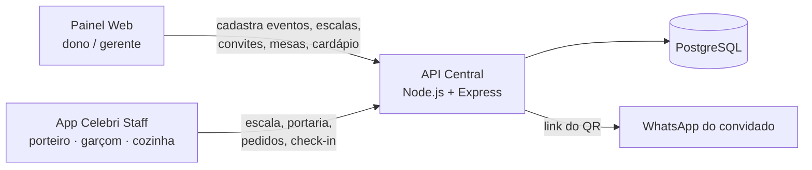
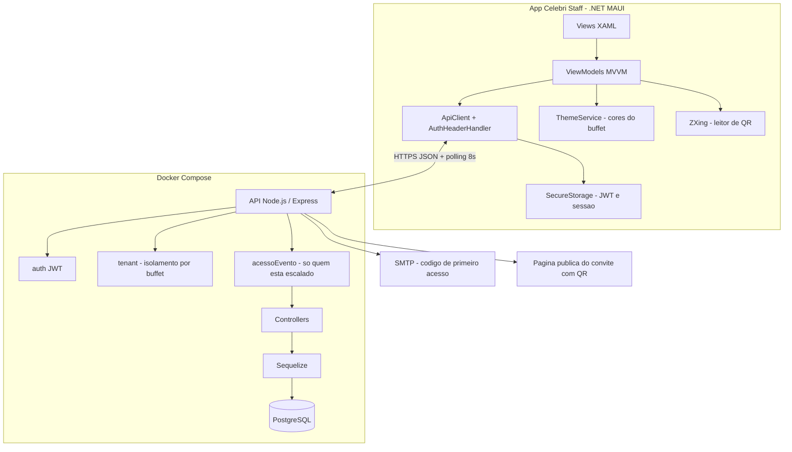
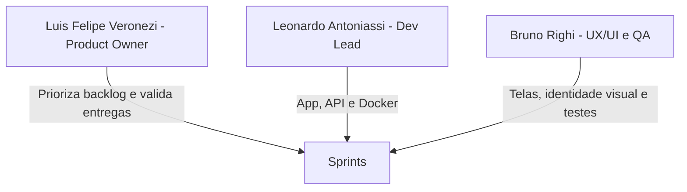
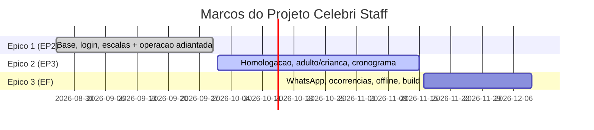
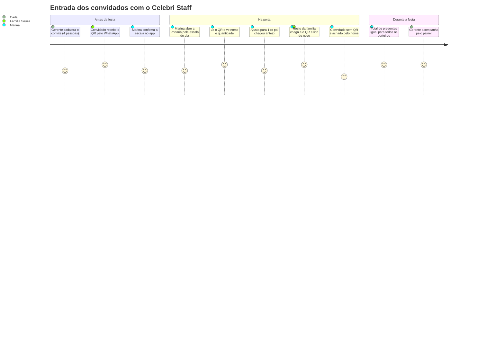

# PROJETO ÁGIL DE SOFTWARE
## Aplicativo Móvel: Celebri Staff — o app da equipe do buffet no dia da festa

> **Em uma frase:** o **Celebri Staff** é o aplicativo Android que os funcionários de um buffet usam **durante o evento**: cada um entra só com o e-mail, vê suas escalas e abre a tela da sua função — **portaria** (contador de pessoas e leitura do QR code do convite), **garçom** (mapa de mesas e comanda) ou **cozinha** (pedidos, cardápio com horários e estoque) —, tudo com a marca e as cores do buffet contratante.

---

## SEÇÃO PRÉ-TEXTUAL

### Histórico de revisão

| Data | Versão | Descrição das Alterações | Autor(es) |
| :---: | :---: | :--- | :--- |
| 26/08/2026 | 1.0 | Plano de Projeto Ágil do App Mobile: Canvas, arquitetura, backlog US01–US07, cronograma de 6 sprints, DoR/DoD e riscos. | Luis Felipe Veronezi (PO), Leonardo Antoniassi (Dev), Bruno Righi (UX/QA) |
| 30/09/2026 | 2.0 | **Projeto Ágil do Aplicativo (Marco 1 / EP2).** Evolução da ideia e refinamentos, visão/escopo/limitações atualizados, funcionalidades por perfil, backlog com status, épicos replanejados, Épico 1 proposto × realizado, desafios, próximos passos, Jornada do Usuário (portaria) e Tratamento de Dados/LGPD. | Luis Felipe Veronezi (PO), Leonardo Antoniassi (Dev), Bruno Righi (UX/QA) |

### Sumário
1. Introdução — contexto, equipe, stack e **evolução da ideia**
2. O Aplicativo — visão, **funcionalidades**, **escopo e limitações**, arquitetura
3. Projeto Ágil — backlog com status, marcos/épicos, **Épico 1 proposto × realizado**, desafios, próximos passos
4. Jornada do Usuário — Portaria com QR code
5. Tratamento de Dados e LGPD
6. Guia de Execução e Testes

---

# 1. INTRODUÇÃO

### 1.1 Apresentação do Documento
Este documento é o **Projeto Ágil do Aplicativo Celebri Staff**, do Projeto Integrador do 5º semestre do curso de Desenvolvimento de Software Multiplataforma. Ele substitui o Plano de Projeto (v1.0) e registra a situação real do projeto no **Marco 1 (EP2)**: o que foi refinado, o que foi entregue e o que falta.

O Celebri Staff faz parte do **Celebri**, uma plataforma **SaaS B2B multilocatária (White Label)** de gestão de buffets e eventos. O painel web (já existente) é usado pelo dono/gerente do buffet; o app é usado pela **equipe operacional no salão** — recepcionistas/porteiros, garçons e cozinha.

### 1.2 Contexto de Negócio: Business Model Canvas

| Bloco do Canvas | Descrição |
| :--- | :--- |
| **Parcerias-Chave** | Provedores de nuvem, serviço de e-mail transacional (SMTP), WhatsApp (links `wa.me`), Google Play Store. |
| **Atividades-Chave** | Evolução da API REST, manutenção do app multiplataforma, identidade visual dinâmica por buffet, infraestrutura em Docker. |
| **Recursos-Chave** | API Node.js/Express, PostgreSQL, app .NET MAUI, painel React, equipe de desenvolvimento. |
| **Proposta de Valor** | O buffet opera a festa inteira pelo celular — escala, portaria, garçom e cozinha — com a própria marca, sem listas de papel nem recados de boca. |
| **Relacionamento com Clientes** | Onboarding do buffet, autosserviço no painel web, suporte direto. |
| **Canais** | Painel web, app Android, WhatsApp para convites e contato. |
| **Segmento de Clientes** | Buffets infantis, casas de festas, espaços de casamento/formatura e cerimoniais. |
| **Estrutura de Custos** | Hospedagem e banco de dados, publicação na loja, esforço de engenharia. |
| **Fontes de Receita** | Assinatura mensal/anual por plano (volume de festas ou número de salões) e taxa de onboarding/personalização. |

### 1.3 O App no Ecossistema Celebri



* **Painel web:** o gerente prepara o evento — funcionários, escala, lista de convidados, mesas do salão e cardápio da cozinha.
* **API central:** regras de negócio, autenticação JWT, isolamento entre buffets (multi-tenant) e persistência.
* **App Celebri Staff:** a operação no dia da festa, a partir desses dados.

### 1.4 Motivação
A operação de uma festa é rápida e barulhenta. Hoje o buffet depende de lista de convidados em papel, contagem "de cabeça" na porta, garçom indo e voltando da cozinha para perguntar e escala combinada por mensagem. O app resolve isso com:
1. **Mobilidade:** cada funcionário trabalha do próprio celular, no salão.
2. **Portaria sem papel:** QR code do convite e contador de pessoas compartilhado entre porteiros.
3. **Garçom ↔ cozinha sem ruído:** o pedido anotado na mesa aparece na tela da cozinha, e o garçom vê quando fica pronto.
4. **Diferencial White Label:** o app aparece com a marca do buffet para a equipe.

### 1.5 Equipe L2Tech
* **Luis Felipe Veronezi** — *Product Owner*: visão do produto, priorização do backlog, validação das entregas.
* **Leonardo Antoniassi** — *Desenvolvedor Fullstack (Dev Lead)*: arquitetura, app, API e Docker.
* **Bruno Righi** — *UX/UI & QA*: interfaces, experiência do usuário, identidade visual dinâmica e testes.

### 1.6 Repositórios Git
* **App móvel (Celebri Staff):** [github.com/leoantoniassi/celebri-staff](https://github.com/leoantoniassi/celebri-staff)
* **Painel web + API central (Celebri):** [github.com/leoantoniassi/celebri](https://github.com/leoantoniassi/celebri)

### 1.7 Stack Definida

| Camada | Tecnologia |
| :--- | :--- |
| App | **.NET MAUI (.NET 10)**, CommunityToolkit.Mvvm, CommunityToolkit.Maui, **ZXing.Net.Maui** (leitor de QR), `SecureStorage` (token e sessão) |
| Alvo | **Android** (emulador e aparelho). iOS fica fora do semestre (exige macOS). |
| API | Node.js + Express, Sequelize, JWT, bcrypt, `qrcode` |
| Banco | PostgreSQL 15 (Docker), migrations SQL versionadas |
| Painel web | React + Vite + Tailwind |
| Infra | Docker Compose |

### 1.8 Evolução da Ideia

**Ponto de partida.** O grupo começou com um sistema web sob medida para **um** buffet ("Mais Alegria", depois "Festify"). Ele foi pivotado para um **SaaS White Label** (renomeado **Celebri**), em que cada buffet assinante tem sua marca. O Plano de Projeto v1.0 previa um app com 7 histórias genéricas: login com **código da empresa**, escalas, portaria com QR, catraca digital, WhatsApp, fotos de ocorrências e modo offline.

**Refinamentos realizados até o Marco 1:**

| # | Refinamento | Por quê |
| :-: | :--- | :--- |
| 1 | **Telas por função**: portaria, garçom e cozinha (antes era um app genérico). | O grupo definiu o que cada função precisa no salão; cada funcionário vê só o que usa. |
| 2 | **Portaria:** contador de pessoas + QR que vale para **1 ou N pessoas** (família), com **quantidade editável** e **lista de convidados opcional** por evento. | Famílias chegam em momentos diferentes; nem todo buffet trabalha com lista. |
| 3 | **Garçom:** mapa de mesas, comanda e anotações — **sem cobrança**. | Em buffet a comida é inclusa; a comanda serve para **pedir à cozinha**, não para cobrar. |
| 4 | **Cozinha:** o que será servido, quantidade, horário previsto e estoque. | Substitui o papel colado na parede e junta com os pedidos dos garçons. |
| 5 | **Login só com e-mail:** o dono cadastra o e-mail do funcionário; no primeiro acesso o app descobre o buffet e o funcionário cria a senha **após um código de 6 dígitos enviado por e-mail**. | Mais simples que digitar código da empresa. O código foi incluído porque, sem ele, qualquer pessoa que soubesse o e-mail poderia criar a senha e tomar a conta. |
| 6 | **Função por escala** e **módulo do app por função**. | A mesma pessoa pode ser garçom num evento e porteiro em outro; cada buffet dá nomes próprios às funções. |
| 7 | **Intervalo mínimo entre escalas configurável** por buffet (antes fixo em 2h). | Pedido do grupo: cada buffet tem sua regra de descanso entre eventos. |
| 8 | **Conta de login ligada ao funcionário** (`usuarios` ↔ `funcionarios`). | Reaproveita o login seguro já existente em vez de criar um segundo sistema. |
| 9 | **Stack .NET MAUI** (Flutter descartado). | Afinidade da equipe com C# e Visual Studio. |

---

# 2. O APLICATIVO

### 2.1 Visão do Produto
> *"Para buffets e salões de festas que precisam de controle na execução dos eventos, o **Celebri Staff** é o aplicativo da equipe do salão: cada funcionário entra com o e-mail, confirma suas escalas e, no dia da festa, usa a tela da sua função — portaria com QR code e contador, comanda do garçom para a cozinha e painel da cozinha com cardápio e estoque. Diferente de listas de papel e recados, tudo fica sincronizado entre os funcionários, com a marca do buffet."*

### 2.2 Funcionalidades do App (o que será entregue no PI)

| Perfil | O que faz no app | Situação |
| :--- | :--- | :---: |
| **Todos** | Entrar só com o e-mail (o app descobre o buffet); primeiro acesso com código de 6 dígitos e criação de senha; identidade visual do buffet (cores, logo, nome). | ✅ |
| **Todos** | **Minhas escalas:** próximos eventos e anteriores, função e local; **confirmar ou recusar** presença; **"Cheguei no evento"** (check-in, de 3h antes até o fim). | ✅ |
| **Porteiro / recepção** | **Contador de pessoas** (+1 / −1) compartilhado entre porteiros; **leitura do QR** do convite com nome e quantidade; **entrada parcial** e correção; busca do convidado pelo nome. | ✅ |
| **Garçom** | **Mapa das mesas** do salão com a situação de cada uma (livre / aguardando cozinha / pronto); **comanda**: itens, quantidade, anotação e alerta de alergia; marcar entregue ou cancelar. | ✅ |
| **Cozinha** | **Pedidos** dos garçons por ordem de chegada (começar / pronto); **cardápio** com o que será servido, quantidade e horário previsto; **estoque** reservado ao evento com alerta de mínimo. | ✅ |
| Porteiro | Contador separado de adultos e crianças com barra de lotação. | 📅 EP3 |
| Todos | Cronograma do evento com avisos de horário. | 📅 EP3 |
| Todos | Contato por WhatsApp em 1 toque; foto de ocorrências; modo offline. | 📅 EF |

**No painel web** (repositório `celebri`), o gerente prepara o que o app usa: funcionário com e-mail (cria a conta do app), função com o **módulo do app**, escala com **função por evento**, **intervalo mínimo** entre escalas, **lista de convidados** com envio do QR pelo WhatsApp, **mapa de mesas** por salão e **cardápio da cozinha** por evento.

### 2.3 Escopo e Limitações

**Dentro do escopo do semestre:** as funcionalidades da tabela 2.2 (entregues e planejadas) e as telas de apoio no painel web.

**Fora do escopo:**
- Financeiro, orçamentos e contratos, que continuam só no painel web.
- Cobrança de consumo pela comanda.
- Versão iOS.
- Publicação na Play Store.

**Limitações conhecidas da versão atual:**
- **Não é tempo real:** as telas de operação atualizam a cada ~8 s (consulta periódica).
- **Sem modo offline:** sem internet o app mostra erro e não guarda entradas para enviar depois (planejado para o EF).
- **E-mail do código:** depende de servidor SMTP configurado; em desenvolvimento, o código aparece no log da API.
- **Leitura de QR:** exige celular com câmera (o emulador não lê QR real).
- **Gerente no app:** o gerente sem vínculo de funcionário ainda não tem atalho para os módulos.

### 2.4 Objetivos do Desenvolvimento
* **Portaria ágil:** validar um convite em poucos segundos e manter um único total de presentes, mesmo com vários porteiros.
* **Escala sem mensagens soltas:** o funcionário confirma a presença e faz check-in pelo app, e o gerente vê no painel.
* **Garçom e cozinha conectados:** o pedido sai da mesa direto para a tela da cozinha, e o "pronto" volta para o garçom.
* **White Label:** aplicar a marca do buffet assim que o e-mail é identificado.

### 2.5 Arquitetura

#### 2.5.1 Componentes
1. **App (.NET MAUI, MVVM):** `Views` (XAML) + `ViewModels` (CommunityToolkit.Mvvm); navegação por **Shell** com rotas por módulo (`portaria`, `garcom`, `cozinha`). A home decide qual módulo abrir pela **função da escala**.
2. **Serviços do app:** `ApiClient` (HttpClient tipado, JSON camelCase), `AuthHeaderHandler` (injeta o JWT), `AuthService` (sessão em `SecureStorage`), `ThemeService` (cores do buffet).
3. **API REST (Node.js/Express):** autenticação JWT; middleware de **tenant** que filtra toda consulta pelo buffet (`emp_id`); middleware **acessoEvento**, que só libera portaria/garçom/cozinha para quem está escalado no evento (ou gerente).
4. **PostgreSQL:** migrations SQL numeradas e idempotentes, aplicadas automaticamente ao subir a API.

#### 2.5.2 Diagrama



#### 2.5.3 Principais rotas usadas pelo app

| Rota | Uso |
| :--- | :--- |
| `POST /api/auth/identificar` | Descobre em quais buffets o e-mail está cadastrado. |
| `POST /api/auth/primeiro-acesso/codigo` · `/confirmar` | Envia o código de 6 dígitos · cria a senha e devolve a sessão. |
| `GET /api/escala/minhas` · `PATCH /:id/confirmacao` · `POST /:id/checkin` | Minhas escalas, resposta e check-in. |
| `/api/portaria/eventos/:id` (+ `/leitura`, `/convites/:id/entrada`, `/avulsos`) | Contador, QR e entradas. |
| `/api/operacao/eventos/:id/mesas` · `/pedidos` · `/cozinha` | Mapa do garçom, comanda e painel da cozinha. |

#### 2.5.4 Evolução do banco (migrations do Épico 1)
* **008:** hash, validade e tentativas do código de primeiro acesso.
* **009:** intervalo de escala por buffet, módulo do app por função, função/confirmação/check-in na escala.
* **010:** `convites` (QR para 1 ou N pessoas) e contador de entradas sem convite no evento.
* **011:** `mesas` (layout do salão), `evento_servico` (cardápio da cozinha), `pedidos` e `pedido_itens`.

### 2.6 Metas e Restrições da Arquitetura

| Categoria | Decisão | Motivo |
| :--- | :--- | :--- |
| Plataforma | .NET MAUI, Android primeiro | Código único, acesso nativo à câmera; iOS exige macOS. |
| Multi-tenant | Filtro automático por `emp_id` em toda consulta | Um buffet nunca vê dados de outro (coberto por testes de integração). |
| Concorrência | Contadores da portaria com `UPDATE` atômico no banco | Vários porteiros ao mesmo tempo sem perder entradas. |
| Atualização | Polling de 8 s nas telas de operação | Simples e suficiente para o salão; tempo real (WebSocket) só se necessário. |
| Identificadores | UUID em todas as tabelas; token do QR aleatório de 128 bits | Evita IDs previsíveis; o QR não revela nada do convite. |
| Resiliência offline | **Planejada (EF)** | Salões têm sinal fraco; hoje o app depende de conexão. |

---

# 3. PROJETO ÁGIL DE SOFTWARE

### 3.1 Escopo por Épico
* **Épico 1 (EP2):** base do app, White Label, login por e-mail, escalas + **operação do evento adiantada** (portaria, garçom, cozinha).
* **Épico 2 (EP3):** homologação da operação em aparelhos reais, contador adulto/criança com lotação, cronograma do evento com avisos, refinamento de UX.
* **Épico 3 (EF):** WhatsApp no app, ocorrências com foto, modo offline, testes automatizados do app e build final.

### 3.2 Papéis no Time Scrum



### 3.3 Backlog do Produto (atualizado)

Legenda: ✅ **Concluído** · 🔄 **Em execução** · 📅 **Planejado**

| ID | História de Usuário | Critérios de Aceite | Prioridade | Épico | Status |
| :-: | :--- | :--- | :-: | :-: | :-: |
| **US01** | **Como** funcionário, **quero** entrar só com meu e-mail, **para que** o app encontre meu buffet e aplique a marca dele. | • E-mail em mais de um buffet → lista para escolher.<br>• Cores, logo e nome do buffet aplicados.<br>• Sessão restaurada ao reabrir. | Alta | 1 | ✅ |
| **US08** | **Como** funcionário novo, **quero** criar minha senha no primeiro acesso, **para que** eu não dependa do gerente. | • Código de 6 dígitos por e-mail, válido 15 min, 5 tentativas.<br>• Só o hash do código é guardado.<br>• Após criar a senha, entra direto. | Alta | 1 | ✅ |
| **US02** | **Como** funcionário, **quero** ver minhas escalas e confirmar ou recusar, **para que** o gerente saiba quem vai. | • Próximos e anteriores, com função e local.<br>• Confirmar/Recusar refletem no painel. | Alta | 1 | ✅ |
| **US09** | **Como** funcionário, **quero** avisar que cheguei, **para que** o gerente acompanhe a equipe. | • Disponível de 3h antes até o fim do evento.<br>• Horário aparece no painel. | Média | 1 | ✅ |
| **US10** | **Como** gerente, **quero** definir o intervalo mínimo entre escalas e a função de cada pessoa por evento, **para que** a escala respeite as regras do buffet. | • Intervalo de 0 a 24h por buffet.<br>• Função por escala; módulo do app por função. | Média | 1 | ✅ |
| **US03** | **Como** porteiro, **quero** ler o QR do convite, **para que** a entrada seja rápida e o nome apareça. | • QR para 1 ou N pessoas.<br>• Quantidade editável; entrada parcial; aviso se passar do previsto.<br>• Busca por nome se não houver QR. | Alta | 1 | ✅ código · 🔄 validar QR em celular real |
| **US04** | **Como** porteiro, **quero** um contador de pessoas, **para que** o buffet saiba quantos estão no salão. | • +1/−1 compartilhado entre porteiros sem perder contagem.<br>• *(EP3)* separar adultos/crianças e barra de lotação. | Média | 1 → 2 | ✅ contador · 📅 adulto/criança |
| **US11** | **Como** garçom, **quero** ver o mapa das mesas e anotar pedidos, **para que** a cozinha receba sem eu ir até lá. | • Mapa com situação por cor.<br>• Itens com quantidade, anotação e alerta de alergia.<br>• Marcar entregue/cancelar. | Alta | 1 | ✅ código · 🔄 homologação |
| **US12** | **Como** cozinha, **quero** ver pedidos, cardápio com horários e estoque, **para que** eu saiba o que preparar e quando. | • Pedidos por ordem de chegada; começar/pronto.<br>• Cardápio pendente → preparando → servido.<br>• Estoque com alerta de mínimo. | Alta | 1 | ✅ código · 🔄 homologação |
| **US13** | **Como** gerente, **quero** cadastrar convidados, mesas e cardápio no painel, **para que** o app tenha os dados do evento. | • Convite com envio do QR pelo WhatsApp.<br>• Mapa de mesas por clique.<br>• Cardápio com horário. | Alta | 1 | ✅ |
| **US14** | **Como** equipe, **quero** ver o cronograma da festa e ser avisado dos horários, **para que** ninguém perca o parabéns ou a hora de servir. | • Linha do tempo do evento.<br>• Aviso no horário. | Média | 2 | 📅 |
| **US05** | **Como** funcionário, **quero** chamar o gerente ou o cliente no WhatsApp em 1 toque. | • Link `wa.me` com mensagem pronta. | Média | 3 | 🔄 no painel (convite) · 📅 no app |
| **US06** | **Como** gerente, **quero** fotografar avarias durante a festa, **para que** fiquem no relatório. | • Câmera, upload e vínculo ao evento. | Baixa | 3 | 📅 |
| **US07** | **Como** porteiro, **quero** continuar registrando entradas sem internet. | • Fila local e sincronização ao reconectar.<br>• Indicador de modo offline. | Baixa | 3 | 📅 |

### 3.4 Marcos e Épicos (replanejados)



| Marco | Data | Tema do Épico |
| :--- | :-: | :--- |
| **EP2 — Épico 1** | 30/09/2026 | **Base do app, White Label, login e escalas** (+ portaria, garçom e cozinha adiantados). |
| **EP3 — Épico 2** | 15/11/2026 | **Operação do evento homologada:** testes em aparelhos reais, contador adulto/criança com lotação, cronograma com avisos, UX. |
| **EF — Épico 3** | 10/12/2026 | **Recursos avançados e entrega:** WhatsApp no app, ocorrências com foto, modo offline, testes automatizados e build final. |

**Por que replanejamos:** no plano original, portaria e catraca eram do Épico 2. Com as funções definidas pelo grupo (portaria, garçom, cozinha), a base de dados e a API dessas telas foram feitas junto com o Épico 1. Com isso, o Épico 2 passa a validar essas telas em uso real e a completar o que ficou de fora.

### 3.5 Épico 1: Proposto × Realizado

| | Proposto (Plano v1.0) | Realizado (até 30/09) |
| :--- | :--- | :--- |
| **Base do app** | Repositório mobile, Docker, autenticação JWT. | ✅ App .NET MAUI (MVVM + Shell), sessão em SecureStorage, ambiente Android documentado. |
| **White Label** | Login com código da empresa aplicando cores e logo. | ✅ Refinado: login **só com e-mail**, o app descobre o buffet e aplica a marca; **primeiro acesso com código por e-mail**. |
| **Escalas** | Listar escalas e aceitar/recusar. | ✅ + função por evento, **check-in**, intervalo configurável e status visível no painel. |
| **Portaria** | *(era Épico 2)* | ✅ adiantado: contador compartilhado, QR para 1/N pessoas, entrada parcial, busca por nome, convite com QR pelo WhatsApp. |
| **Garçom e cozinha** | *(não existiam no plano)* | ✅ adiantado: mapa de mesas, comanda com alerta de alergia, painel da cozinha com pedidos, cardápio e estoque. |

**Evidências:**
- **Commits:** 3 commits por repositório, um por etapa.
  - `celebri`: `bd3bbf0`, `5ff3cb8`, `9d91c6b`.
  - `celebri-staff`: `23eb358`, `82cbd20`, `74f8e1c`.
- **Testes:** **256 testes automatizados** do backend passando, incluindo isolamento entre buffets contra o banco real, e checagens de ponta a ponta contra a API rodando.
- **App:** compila sem erros nem avisos.
- **Emulador:** fluxos de login, escala e portaria validados.
- **Roteiro de homologação:** [`TESTE_MANUAL.md`](TESTE_MANUAL.md).

### 3.6 Desafios e Como Foram Enfrentados

| Desafio | Como enfrentamos |
| :--- | :--- |
| **Escolha da tecnologia mobile** (MAUI ou Flutter). | Decidimos por .NET MAUI pela afinidade com C#/Visual Studio e registramos a decisão no documento. |
| **Ambiente Android no Windows:** JDK incompatível, SDK faltando e o empacotador `aapt2` quebrando com o "Á" de "Área de Trabalho". | Fixamos o JDK 21 do Android Studio, instalamos o SDK 36 e movemos a pasta de build para fora do caminho com acento (`Directory.Build.props`). Passo a passo documentado. |
| **Runtime .NET 10.0.12 corrompido** na máquina de desenvolvimento. | Montamos uma instalação paralela apontando para a versão 10.0.11 íntegra, sem mexer na original; reparo pelo Visual Studio Installer pendente. |
| **Bugs que só apareciam rodando de verdade:** login enviando JSON em PascalCase, crash de navegação do Shell, seed sem empresa, `POST /escala` pedindo coluna inexistente, eventos sem local sumindo da lista. | Adotamos a regra de **testar contra a API real e o emulador**, não só testes com mocks. Todos foram corrigidos e viraram casos de teste. |
| **Segurança do login só com e-mail:** quem soubesse o e-mail poderia criar a senha. | Código de 6 dígitos por e-mail, guardado só como hash, com validade de 15 min, 5 tentativas e limite de requisições por IP. |
| **Vários porteiros contando ao mesmo tempo.** | Contagem feita no banco com `UPDATE` atômico; teste com 10 entradas simultâneas sem perda. |
| **Sinal de internet fraco no salão.** | Por ora, telas leves com atualização periódica. Modo offline replanejado para o EF (risco R1 aberto). |
| **Mudança de nome do produto** (Festify → Celebri) no meio do projeto. | Renomeação feita de uma vez em código, banco e documentos, sem perder histórico. |
| *(Desafios de organização da equipe — a completar pela equipe.)* | |

### 3.7 Sprints

| Período | Sprint | Foco | Histórias |
| :-: | :-: | :--- | :--- |
| Set / EP2 | 1–2 | Base, login por e-mail, escalas, portaria, garçom e cozinha | US01, US02, US03, US04 (contador), US08–US13 ✅ |
| Out / EP3 | 3 | Homologação em aparelhos (roteiro `TESTE_MANUAL.md`), QR em celular real, correções | US03, US11, US12 🔄 |
| Nov / EP3 | 4 | Contador adulto/criança com lotação; cronograma com avisos; ajustes de UX | US04, US14 📅 |
| Nov / EF | 5 | WhatsApp no app; ocorrências com foto | US05, US06 📅 |
| Dez / EF | 6 | Modo offline, testes automatizados do app, build final | US07 📅 |

### 3.8 Definição de Preparada (DoR)
1. História no formato *Como / quero / para que*.
2. Critérios de aceite objetivos e testáveis.
3. Protótipo ou esboço de tela aprovado pelo UX (Bruno Righi).
4. Rotas e tabelas necessárias definidas.
5. Cabe em uma sprint quinzenal.

### 3.9 Definição de Pronta (DoD)
1. Código revisado e versionado no GitHub.
2. Segue a arquitetura (UUID, isolamento por buffet, MVVM no app).
3. **Testes automatizados do backend passando** e build do app sem erros.
4. **Passos correspondentes do `TESTE_MANUAL.md` executados** em emulador ou aparelho.
5. Sem crashes conhecidos e aprovado pelo PO.

### 3.10 Matriz de Riscos

| Risco | Prob. | Impacto | Mitigação | Situação |
| :--- | :-: | :-: | :--- | :-: |
| **R1.** Internet fraca no salão. | Alta | Alto | Telas leves; modo offline no EF (US07). | Aberto |
| **R2.** Câmera de celular antigo não ler o QR. | Média | Alto | ZXing.Net.Maui; **busca por nome** já implementada como alternativa. | Mitigado |
| **R3.** Choque de horário na escala. | Média | Médio | Validação no servidor com intervalo configurável por buffet. | Resolvido |
| **R4.** Atraso nos protótipos de UI. | Baixa | Médio | Componentes nativos reutilizados; refinamento de UX no EP3. | Aberto |
| **R5.** Ambiente Docker/Android diferente entre membros. | Média | Alto | Docker Compose padronizado; ambiente Android documentado. | Mitigado |
| **R6.** Sem SMTP em produção, o código do primeiro acesso não chega. | Média | Alto | Configurar serviço de e-mail transacional antes do EP3. | Aberto |
| **R7.** Funcionalidades adiantadas sem teste em uso real. | Média | Médio | Homologação guiada pelo `TESTE_MANUAL.md` na Sprint 3. | Em execução |

### 3.11 Próximos Passos até o EP3 (15/11/2026)
1. **Homologar** portaria, garçom e cozinha em **celulares reais** seguindo o `TESTE_MANUAL.md` e corrigir o que aparecer.
2. **Contador adulto/criança** com **barra de lotação** do salão (completar US04).
3. **Cronograma do evento** com avisos de horário (US14), aproveitando o cardápio com horários.
4. Atalho para o **gerente** abrir os módulos no app.
5. **Refinar a UX** das telas de operação com base nos testes (Bruno Righi).
6. Configurar **SMTP** e publicar os commits via Pull Request.

---

# 4. JORNADA DO USUÁRIO — Portaria com QR Code

**Funcionalidade principal:** a entrada dos convidados no dia da festa, do convite ao contador.

**Personas:**
* **Marina, 24, recepcionista** — trabalha em dois buffets; na porta, com fila e barulho, precisa de agilidade.
* **Família Souza** — 4 pessoas no mesmo convite; o pai chega antes, o resto depois.
* **Carla, gerente do buffet** — quer saber quantas pessoas já entraram sem sair de onde está.



| # | Etapa | Canal / Tela | Ação | Sentimento | Dor resolvida | Oportunidade |
| :-: | :--- | :--- | :--- | :-: | :--- | :--- |
| 1 | Preparação | Painel web → Evento → Convidados | Carla liga a lista, cadastra "Família Souza (4)" e envia pelo WhatsApp. | 🙂 | Lista em papel que se perdia. | Importar lista por planilha. |
| 2 | Convite | WhatsApp → página do convite | A família abre o link e vê o QR, o evento e "válido para 4 pessoas". | 😀 | Convite sem controle de quantidade. | Lembrete automático na véspera. |
| 3 | Escala | App → Minhas escalas | Marina confirma e, ao chegar, toca **Cheguei no evento**. | 🙂 | Escala combinada por mensagem. | Aviso push de nova escala. |
| 4 | Abrir portaria | App → **Abrir Portaria** | Vê "0 pessoas presentes de 50 previstos". | 🙂 | Contagem "de cabeça". | Contador adulto/criança (EP3). |
| 5 | Leitura | App → Ler QR code | Aponta a câmera; abre "Família Souza · faltam 4". | 😀 | Procurar nome na lista com fila. | Som/vibração de confirmação. |
| 6 | Entrada parcial | App → Entrada do convidado | Só o pai chegou: ajusta para 1 e registra. | 🙂 | Papel sem registro de quem já entrou. | — |
| 7 | Segunda leitura | App → Ler QR code | O resto chega: "já entraram 1 · faltam 3", registra 3. Se vier alguém a mais, o app avisa. | 😀 | Convite "reaproveitado" sem controle. | — |
| 8 | Sem QR | App → Busca por nome | Convidado esqueceu o celular: Marina busca "souz" e registra. | 😐 | Convidado barrado ou liberado sem controle. | — |
| 9 | Acompanhamento | App (vários porteiros) e Painel | O total é o mesmo para todos; Carla vê os números no painel. | 😀 | Dois porteiros com contagens diferentes. | Alerta de lotação máxima. |

---

# 5. TRATAMENTO DE DADOS E LGPD

A Lei Geral de Proteção de Dados (Lei 13.709/2018) se aplica porque o app trata dados de **funcionários** e de **convidados** dos buffets.

### 5.1 Dados Pessoais Tratados

| Titular | Dados | Finalidade | Onde fica |
| :--- | :--- | :--- | :--- |
| **Funcionário** | Nome, e-mail, telefone, função | Cadastro da equipe e contato do gerente. | `funcionarios` |
| **Funcionário** | Escalas, confirmação, horário de check-in | Organização da equipe no evento. | `escala` |
| **Usuário (login)** | E-mail, **hash bcrypt da senha**, **hash SHA-256 do código** de primeiro acesso, perfil | Autenticação. | `usuarios` |
| **Convidado** | Nome (ou família), telefone, quantidade de pessoas, quantos entraram | Envio do convite e controle da entrada. | `convites` |
| **Pedido** | Itens, anotações, alerta de alergia — **sem nome do convidado**, só a mesa | Preparo na cozinha. | `pedidos`, `pedido_itens` |

No app, só o **token de sessão (JWT)** e os dados básicos do usuário ficam no aparelho, dentro do `SecureStorage` (área criptografada do Android).

### 5.2 Papéis (art. 5º)
* **Controlador:** o **buffet contratante**. Ele decide quem cadastrar e para quê.
* **Operador:** a **plataforma Celebri**, que trata os dados em nome do buffet.
* **Isolamento:** cada buffet só acessa os próprios dados. Toda consulta é filtrada automaticamente pelo buffet (`emp_id`), e testes de integração verificam que um buffet não vê dados de outro.

### 5.3 Bases Legais (art. 7º)

| Tratamento | Base legal |
| :--- | :--- |
| Dados de funcionários e escalas | **Execução de contrato** (relação de trabalho/prestação de serviço) — art. 7º, V. |
| Dados de convidados (nome, telefone, quantidade) | **Execução do contrato** do evento com o cliente do buffet e **legítimo interesse** no controle de acesso — art. 7º, V e IX. O buffet deve **informar** o convidado. |
| Login e segurança | **Legítimo interesse** e **segurança** da conta — art. 7º, IX. |

**Dado sensível:** a marcação "alergia/restrição" num pedido pode revelar **dado de saúde** (art. 11). Por isso:
- o pedido é ligado à **mesa**, nunca ao nome do convidado;
- a anotação deve ser mínima (ex.: "sem glúten");
- fica como diretriz de uso para os buffets.

### 5.4 Princípios Aplicados no Sistema (art. 6º)

| Princípio | Como aparece no código |
| :--- | :--- |
| **Necessidade / minimização** | O QR code carrega só um **token aleatório**, sem nome nem telefone. A página pública do convite mostra apenas nome, evento e quantidade. |
| **Finalidade** | Os dados de convidado só servem à portaria do evento. A portaria só abre para quem está **escalado naquele evento** (ou para o gerente). |
| **Segurança** | Senhas com **bcrypt**; código de primeiro acesso guardado só como **hash**, com validade de 15 min e 5 tentativas; **limite de requisições** nas rotas públicas; JWT; `SecureStorage` no app; isolamento entre buffets testado. |
| **Prevenção** | A identificação por e-mail revela em quais buffets o e-mail está (necessário para o login), por isso tem **limite de requisições por IP**; o envio do código responde sempre a mesma mensagem. Os links de convite usam tokens impossíveis de adivinhar (128 bits). |
| **Transparência** | Este documento e o aviso ao convidado (pendente, ver 5.7). |

### 5.5 Direitos dos Titulares (art. 18)
* **Acesso e correção:** o buffet consulta e edita funcionários e convites no painel.
* **Eliminação:** remover funcionário/convite no painel inativa o registro (exclusão lógica) e o QR deixa de funcionar. A **anonimização definitiva** está planejada.
* **Canal:** o titular fala com o buffet (controlador), que atende pelo painel.

### 5.6 Retenção
Dados de convidados só são necessários até o fim do evento e do eventual acerto com o cliente. Está **planejada** uma rotina que **anonimiza convites e check-ins** depois de um prazo configurável (ex.: 90 dias após o evento).

### 5.7 Pendências LGPD no Backlog

| Pendência | Épico |
| :--- | :-: |
| Aviso de privacidade na página do convite e no primeiro acesso do app. | 2 |
| Rotina de anonimização automática após o prazo de retenção. | 3 |
| Registro de acessos (quem leu qual convite e quando). | 3 |
| SMTP transacional com remetente do buffet. | 2 |

---

# 6. GUIA DE EXECUÇÃO E TESTES

O roteiro completo de homologação — 5 sessões, ~2h, com o resultado esperado de cada passo, cobrindo painel web e app — está em **[`TESTE_MANUAL.md`](TESTE_MANUAL.md)**.

### 6.1 Pré-requisitos
1. **Backend:** clone o repositório [celebri](https://github.com/leoantoniassi/celebri), copie `.env.example` para `.env` (ajuste `DB_PASS`/`JWT_SECRET`) e suba:
   ```
   docker compose up -d --build
   docker compose exec backend npm run seed
   ```
   As migrations são aplicadas ao subir a API. Teste: `http://localhost:3001/api/health`.
2. **App:** Visual Studio 2026 com o workload **.NET MAUI**, e um emulador Android ou celular com depuração USB.
3. No emulador, o app usa `http://10.0.2.2:3001/api/` (ver `Services/Api/AppConfig.cs`). No celular, troque pelo IP do computador na rede.
4. Sem SMTP no `.env`, o **código de primeiro acesso** aparece no log da API: `docker compose logs backend | grep "código de primeiro acesso"`.

### 6.2 Credenciais de teste (seed)

| Perfil | Login |
| :--- | :--- |
| Gerente | `gerente@celebri.com` / `123456` |
| Operador (vinculado à funcionária "Alice Rodrigues") | `operador@celebri.com` / `123456` |

### 6.3 Como rodar o app
- **Visual Studio:** selecione o projeto `CelebriStaff`, escolha o emulador/dispositivo Android e pressione **F5**.
- **Linha de comando:** `dotnet build -t:Run -f net10.0-android`

### 6.4 Dicas de depuração
- Sem cores ou "empresa não encontrada": confira se o seed rodou sem erro.
- Crashes do app: `adb logcat -d | grep -i FATAL`.
- Erro 400 no login: API fora do ar ou `.env` sem `JWT_SECRET`.
